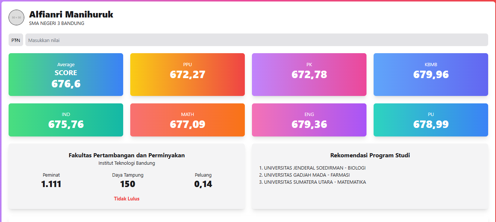
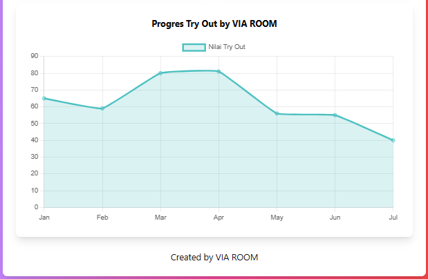

# Viaroom

## Deskripsi
Proyek ini bertujuan untuk menciptakan sebuah dashboard interaktif menggunakan JavaScript dan HTML. Dashboard ini akan menyajikan berbagai informasi penting dan visualisasi data terkait dengan progres latihan tryout siswa dan kinerja sekolah secara keseluruhan.

## Fitur
- Tampilan data statistik
- Grafik 
- Form input pengguna
- Rekomendasi 

## Hasil

